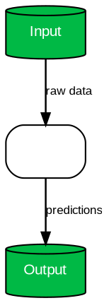

# sci-craft Phase 1 实施计划

> **For agentic workers:** REQUIRED SUB-SKILL: Use superpowers:subagent-driven-development (recommended) or superpowers:executing-plans to implement this plan task-by-task. Steps use checkbox (`- [ ]`) syntax for tracking.

**Goal:** 搭建 sci-craft 核心框架，实现 Phase 1 的 3 个 P0 Skill（sci-figure、sci-framework、sci-polishing）+ TRAE 适配器 + 构建工具

**Architecture:** 四层分层架构——核心层（期刊配置+规则库）、Skill 层（功能模块）、构建层（组装+校验）、适配层（多平台转换）。Skill 一次编写，通过适配器自动适配 TRAE/Codex/Claude Code。

**Tech Stack:** Python 3.10+, YAML, Markdown, matplotlib, Graphviz, pytest, argparse

**Spec:** `docs/superpowers/specs/2026-06-26-sci-craft-design.md`

---

## File Structure

| File | Responsibility |
|------|----------------|
| `core/journals/_base.yaml` | 通用学术写作基线配置 |
| `core/journals/nature.yaml` | Nature 期刊规范 |
| `core/journals/science.yaml` | Science 期刊规范 |
| `core/rules/writing/sentence-length.md` | 句子长度规则 |
| `core/rules/writing/hedging.md` | 模糊表达规则 |
| `core/rules/writing/tense.md` | 时态规则 |
| `core/rules/writing/overclaim-detect.md` | 过度宣称检测规则 |
| `core/rules/writing/chinese-academic.md` | 中文学术写作规范 |
| `core/rules/figure/typography.md` | 图表字体规则 |
| `core/rules/figure/palette-nature.md` | Nature 配色方案 |
| `core/rules/figure/palette-science.md` | Science 配色方案 |
| `core/rules/figure/layout.md` | 图表布局规则 |
| `core/rules/figure/framework-diagram.md` | 框架图规则 |
| `core/rules/citation/format-nature.md` | Nature 引文格式规则 |
| `core/rules/citation/format-science.md` | Science 引文格式规则 |
| `core/rules/citation/integrity.md` | 引文完整性规则 |
| `core/templates/figures/bar-template.py` | 柱状图模板 |
| `core/templates/figures/line-template.py` | 折线图模板 |
| `core/templates/figures/heatmap-template.py` | 热力图模板 |
| `core/templates/figures/framework-template.py` | 框架图模板 |
| `skills/_shared/glossary.md` | 术语表 |
| `skills/_shared/style-guide.md` | 通用风格指南 |
| `skills/sci-figure/SKILL.md` | 科研图表 Skill 指令 |
| `skills/sci-figure/README.md` | 科研图表使用说明 |
| `skills/sci-figure/manifest.yaml` | 科研图表元数据 |
| `skills/sci-figure/references/design-theory.md` | 图表设计理论 |
| `skills/sci-figure/references/chart-types.md` | 图表类型参考 |
| `skills/sci-figure/references/common-patterns.md` | 常用模式参考 |
| `skills/sci-framework/SKILL.md` | 框架图 Skill 指令 |
| `skills/sci-framework/README.md` | 框架图使用说明 |
| `skills/sci-framework/manifest.yaml` | 框架图元数据 |
| `skills/sci-framework/references/dot-syntax.md` | Graphviz dot 语法参考 |
| `skills/sci-framework/references/diagram-patterns.md` | 框架图模式参考 |
| `skills/sci-polishing/SKILL.md` | 文本润色 Skill 指令 |
| `skills/sci-polishing/README.md` | 文本润色使用说明 |
| `skills/sci-polishing/manifest.yaml` | 文本润色元数据 |
| `skills/sci-polishing/references/phrasebank.md` | 学术用语库 |
| `skills/sci-polishing/references/section-moves.md` | 章节修辞模式 |
| `skills/sci-polishing/references/style-guardrails.md` | 风格护栏 |
| `adapters/base.py` | 适配器基类 |
| `adapters/trae.py` | TRAE 适配器 |
| `builder/assembler.py` | 规则组装器 |
| `builder/validator.py` | Skill 校验器 |
| `scripts/build.py` | 构建命令入口 |
| `scripts/install.py` | 安装命令 |
| `tests/test_assembler.py` | 组装器测试 |
| `tests/test_validator.py` | 校验器测试 |
| `tests/test_adapters.py` | 适配器测试 |
| `.github/workflows/validate.yml` | CI 自动校验 |
| `.gitignore` | Git 忽略规则 |
| `pyproject.toml` | 项目配置 |

---

## Task 1: 项目脚手架

**Files:**
- Create: `.gitignore`
- Create: `pyproject.toml`
- Create: `skills/_shared/glossary.md`
- Create: `skills/_shared/style-guide.md`

- [ ] **Step 1: 初始化 git 仓库**

```bash
cd "D:\TRAE SOLO CN\写skill"
git init
```

- [ ] **Step 2: 创建 .gitignore**

```gitignore
# Python
__pycache__/
*.py[cod]
*.egg-info/
dist/
build/
.venv/
venv/

# Output
output/

# IDE
.idea/
.vscode/
*.swp

# OS
.DS_Store
Thumbs.db
```

- [ ] **Step 3: 创建 pyproject.toml**

```toml
[project]
name = "sci-craft"
version = "0.1.0"
description = "Multi-journal, multi-platform academic writing Skill framework"
requires-python = ">=3.10"
dependencies = [
    "pyyaml>=6.0",
]

[project.optional-dependencies]
dev = [
    "pytest>=7.0",
    "pytest-cov>=4.0",
]

[project.scripts]
sci-craft = "scripts.build:main"

[tool.pytest.ini_options]
testpaths = ["tests"]
```

- [ ] **Step 4: 创建目录结构**

```bash
cd "D:\TRAE SOLO CN\写skill"
mkdir -p core\journals core\rules\writing core\rules\figure core\rules\citation core\templates\figures
mkdir -p skills\_shared skills\sci-figure\references skills\sci-framework\references skills\sci-polishing\references
mkdir -p adapters builder scripts tests output
mkdir -p .github\workflows
```

- [ ] **Step 5: 创建 _shared/glossary.md**

```markdown
# Academic Writing Glossary

## General Terms
- **CNS**: Cell, Nature, Science — the top three scientific journals
- **AAAS**: American Association for the Advancement of Science (publisher of Science)
- **Hedging**: Using cautious language to match claim strength to evidence
- **Overclaim**: Making statements stronger than the evidence supports

## Writing Terms
- **Move**: A rhetorical unit in academic writing (e.g., "establishing a niche")
- **Signal phrase**: A phrase introducing a citation (e.g., "as demonstrated by")
- **Hedge word**: A word that softens a claim (e.g., "suggest", "may", "indicate")

## Figure Terms
- **rcParams**: matplotlib runtime configuration parameters
- **SVG**: Scalable Vector Graphics — preferred output format for journal figures
- **Panel**: A single subplot within a multi-panel figure
- **Framework diagram**: A schematic showing the architecture or flow of a system
```

- [ ] **Step 6: 创建 _shared/style-guide.md**

```markdown
# Universal Style Guide

## Core Principles
1. **Evidence first**: Never invent data, mechanisms, references, or statistics
2. **Precision over persuasion**: Use the minimum claim strength the evidence supports
3. **Reproducibility**: Every figure must be reproducible from the provided code
4. **Journal awareness**: Adapt style to target journal before writing

## Figure Standards
- Primary output: SVG (vector, editable)
- Secondary output: PNG at journal-required DPI
- Font: sans-serif (Arial or Helvetica)
- Text in SVG must remain as `<text>` nodes, never converted to paths

## Writing Standards
- One idea per sentence
- No sentence exceeds journal max word count
- Cite only sources personally read and verified
- Flag absolute claims for review
```

- [ ] **Step 7: 初始提交**

```bash
cd "D:\TRAE SOLO CN\写skill"
git add .gitignore pyproject.toml skills/_shared/
git commit -m "chore: scaffold project structure with shared resources"
```

---

## Task 2: 期刊配置 (core/journals/)

**Files:**
- Create: `core/journals/_base.yaml`
- Create: `core/journals/nature.yaml`
- Create: `core/journals/science.yaml`

- [ ] **Step 1: 创建 _base.yaml**

```yaml
# Base journal configuration — all journals inherit from this
name: Base
family: generic
publisher: ""

writing:
  max_sentence_words: 35
  english_variant: british
  hedging_levels: 3
  tense_rules:
    abstract: present
    introduction: present
    methods: past
    results: past
    discussion: present_hedged
    conclusion: present_hedged
  forbidden_words: [prove, definitely, always, never, perfectly]

figure:
  font_family: sans-serif
  font_sans: [Arial, DejaVu Sans, Liberation Sans]
  output_format:
    primary: svg
    secondary: png@300dpi
  min_dpi: 300
  framework_diagram:
    enabled: false
    tool: graphviz+matplotlib
    style: minimal-flat

citation:
  style: numbered
  export_formats: [enw, ris, bibtex]
  max_authors_display: 6

submission:
  cover_letter_required: false
  data_availability_required: false
  competing_interests_required: false
```

- [ ] **Step 2: 创建 nature.yaml**

```yaml
# Nature journal configuration
# Inherits from _base.yaml and overrides
name: Nature
family: CNS
publisher: Springer Nature

writing:
  max_sentence_words: 30
  english_variant: british
  hedging_levels: 3
  tense_rules:
    abstract: present
    introduction: present
    methods: past
    results: past
    discussion: present_hedged
    conclusion: present_hedged
  forbidden_words: [prove, establish, breakthrough, definitely, perfectly, always, never]

figure:
  font_family: sans-serif
  font_sans: [Arial, DejaVu Sans, Liberation Sans]
  output_format:
    primary: svg
    secondary: png@300dpi
  min_dpi: 300
  palette: nature-primary
  framework_diagram:
    enabled: true
    tool: graphviz+matplotlib
    style: minimal-flat

citation:
  style: nature-numbered
  export_formats: [enw, ris, zotero-rdf]
  max_authors_display: 5

submission:
  cover_letter_required: true
  data_availability_required: true
  competing_interests_required: true
```

- [ ] **Step 3: 创建 science.yaml**

```yaml
# Science journal configuration
# Inherits from _base.yaml and overrides
name: Science
family: AAAS
publisher: AAAS

writing:
  max_sentence_words: 25
  english_variant: american
  hedging_levels: 4
  tense_rules:
    abstract: present
    introduction: present
    methods: past
    results: past
    discussion: present_hedged
    conclusion: present_hedged
  forbidden_words: [prove, demonstrate conclusively, definitely, perfectly, always, never]

figure:
  font_family: sans-serif
  font_sans: [Helvetica, Arial]
  output_format:
    primary: svg
    secondary: png@600dpi
  min_dpi: 600
  palette: science-primary
  framework_diagram:
    enabled: true
    tool: graphviz+matplotlib
    style: structured-blocks

citation:
  style: science-numbered
  export_formats: [enw, ris, bibtex]
  max_authors_display: 10

submission:
  cover_letter_required: true
  data_availability_required: true
  competing_interests_required: true
```

- [ ] **Step 4: 提交**

```bash
cd "D:\TRAE SOLO CN\写skill"
git add core/journals/
git commit -m "feat: add Nature and Science journal configurations"
```

---

## Task 3: 规则库 (core/rules/)

**Files:**
- Create: `core/rules/writing/sentence-length.md`
- Create: `core/rules/writing/hedging.md`
- Create: `core/rules/writing/tense.md`
- Create: `core/rules/writing/overclaim-detect.md`
- Create: `core/rules/writing/chinese-academic.md`
- Create: `core/rules/figure/typography.md`
- Create: `core/rules/figure/palette-nature.md`
- Create: `core/rules/figure/palette-science.md`
- Create: `core/rules/figure/layout.md`
- Create: `core/rules/figure/framework-diagram.md`
- Create: `core/rules/citation/format-nature.md`
- Create: `core/rules/citation/format-science.md`
- Create: `core/rules/citation/integrity.md`

- [ ] **Step 1: 创建写作规则 — sentence-length.md**

```markdown
# Sentence Length Rule

## Rule
Every sentence must not exceed {{max_sentence_words}} words (configured per journal).

## Enforcement
1. Count words in each sentence individually
2. The last sentence of a paragraph is most likely to fail — check it first
3. Split long sentences by:
   - Identifying the primary claim and subordinate clauses
   - Breaking at natural boundaries (conjunctions, relative pronouns)
   - Ensuring each new sentence has its own subject and verb

## Examples

### Too long (32 words)
> "Our results demonstrate that the proposed method significantly outperforms existing approaches across all evaluated metrics, which suggests that the integration of multi-scale features provides a substantial advantage in this task."

### Fixed (2 sentences, 15 + 14 words)
> "Our results demonstrate that the proposed method significantly outperforms existing approaches across all evaluated metrics. This suggests that integrating multi-scale features provides a substantial advantage in this task."
```

- [ ] **Step 2: 创建写作规则 — hedging.md**

```markdown
# Hedging Rule

## Rule
Match claim strength to evidence strength using calibrated hedging levels.

## Hedging Levels

| Level | Signal verbs | When to use |
|-------|-------------|-------------|
| 1 (Strong) | demonstrate, show, establish | Direct experimental evidence with controls |
| 2 (Moderate) | indicate, suggest, reveal | Correlational or indirect evidence |
| 3 (Cautious) | may reflect, could imply, appears to | Speculative interpretation |
| 4 (Tentative) | might be attributed to, remains possible | Minimal or preliminary evidence |

## Calibration Rules
- **Results section**: Use Level 1–2 only (data-supported claims)
- **Discussion section**: Use Level 2–4 (interpretive claims)
- **Never** use Level 1 for claims beyond the scope of your experiments
- When downgrading a claim, preserve the original meaning — do not weaken the argument

## Common Mistakes
- "proves" → too strong for any empirical claim; use "demonstrates" at most
- "it is clear that" → presumes agreement; use "the data indicate that"
- "obviously" → violates hedging principle; remove entirely
```

- [ ] **Step 3: 创建写作规则 — tense.md**

```markdown
# Tense Rule

## Rule
Use section-appropriate verb tenses as configured per journal.

## Section-Tense Mapping

| Section | Tense | Example |
|---------|-------|---------|
| Abstract | Present | "X plays a key role in Y" |
| Introduction | Present | "X is widely studied because..." |
| Methods | Past | "We measured X using Y" |
| Results | Past + quantitative detail | "X decreased by 30% (p < 0.01)" |
| Discussion | Present hedged | "These findings suggest that X may influence Y" |
| Conclusion | Present hedged | "This approach may offer a path toward..." |

## Common Errors
- Mixing past and present in Results: "We found X and this indicates Y" → "We found X. This indicates Y." (split into two sentences with correct tenses)
- Using present for methods: "We measure X" → "We measured X"
- Using past for established knowledge in Introduction: "X was important" → "X is important"
```

- [ ] **Step 4: 创建写作规则 — overclaim-detect.md**

```markdown
# Overclaim Detection Rule

## Rule
Flag and revise any statement that exceeds what the evidence supports.

## Detection Categories

### 1. Absolute claims
- **Pattern**: "all", "every", "never", "always", "entirely", "completely"
- **Fix**: Replace with scoped language: "in all tested conditions", "across our sample"

### 2. Unwarranted causation
- **Pattern**: "X caused Y" when only correlation was measured
- **Fix**: "X was associated with Y" or "X correlated with Y"

### 3. Scope expansion
- **Pattern**: Generalizing from a narrow study to broad claims
- **Fix**: Add boundary: "In this cohort...", "Under these conditions..."

### 4. Unverified "first"
- **Pattern**: "This is the first study to..."
- **Fix**: Only use after thorough literature verification; default to "To our knowledge, this is among the first..."

### 5. Excessive novelty claims
- **Pattern**: "novel", "groundbreaking", "unprecedented"
- **Fix**: Describe what is different without the adjective; let the reader judge novelty

## Review Checklist
- [ ] No absolute claims without exhaustive evidence
- [ ] No causal claims without causal evidence
- [ ] No generalizations beyond the study scope
- [ ] No "first" claims without literature search
- [ ] No self-assessed novelty adjectives
```

- [ ] **Step 5: 创建写作规则 — chinese-academic.md**

```markdown
# Chinese Academic Writing Rule

## Rule
Follow Chinese academic writing conventions when producing Chinese-language output.

## Key Conventions

### 1. 术语规范
- 首次出现时使用"中文全称（英文缩写）"格式
- 例："卷积神经网络（CNN）"
- 后续使用缩写即可

### 2. 句式规范
- 学术论文使用书面语，避免口语化表达
- 避免"我们觉得"、"大概"等不确定表达
- 使用"本文认为"、"推测"等规范表达

### 3. 逻辑连接
- 使用规范连接词："因此"、"然而"、"此外"、"综上所述"
- 避免"然后"、"所以说"等口语连接

### 4. 引用格式
- 中文期刊：作者-年份制或顺序编码制（按目标期刊要求）
- 中英文混排时，英文作者保留原名，不翻译

### 5. 标点规范
- 中文正文使用全角标点
- 公式、数字、英文缩写前后使用半角空格
- 句号使用"。"，不使用"."
```

- [ ] **Step 6: 创建图表规则 — typography.md**

```markdown
# Figure Typography Rule

## Rule
All figures must use journal-configured typography settings.

## Mandatory rcParams (Python/matplotlib)

```python
plt.rcParams['font.family'] = '{{font_family}}'
plt.rcParams['font.sans-serif'] = {{font_sans_list}}
plt.rcParams['svg.font_type'] = 'none'  # text stays as <text>, not paths
plt.rcParams['font.size'] = 8
plt.rcParams['axes.linewidth'] = 0.5
plt.rcParams['xtick.major.width'] = 0.5
plt.rcParams['ytick.major.width'] = 0.5
plt.rcParams['xtick.major.size'] = 3
plt.rcParams['ytick.major.size'] = 3
plt.rcParams['xtick.direction'] = 'in'
plt.rcParams['ytick.direction'] = 'in'
plt.rcParams['axes.labelsize'] = 8
plt.rcParams['xtick.labelsize'] = 7
plt.rcParams['ytick.labelsize'] = 7
plt.rcParams['legend.fontsize'] = 7
```

## Font Rules
- Minimum font size: 6pt (axis labels); 5pt (tick labels)
- All text must be editable in SVG (never convert to paths)
- Use only the journal-configured font family
- Bold only for panel labels (a, b, c...), not for axis labels

## Output Rules
- Primary: SVG (vector, editable, text as <text> nodes)
- Secondary: PNG at journal-required DPI
- Never save as JPG for scientific figures
```

- [ ] **Step 7: 创建图表规则 — palette-nature.md**

```markdown
# Nature Color Palette

## Rule
Use the Nature primary palette for data visualization in Nature-family journals.

## Primary Palette

| Name | Hex | Usage |
|------|-----|-------|
| Nature Blue | #0C5DA5 | Primary data series |
| Nature Green | #00B945 | Second series / positive |
| Nature Red | #FF2C00 | Third series / negative |
| Nature Orange | #FF9500 | Fourth series |
| Nature Purple | #845B97 | Fifth series |
| Nature Gray | #474747 | Neutral / background |

## Usage Rules
1. Use colors in the order listed above — do not skip positions
2. Maximum 6 distinct colors per figure; use hatching/patterns for more
3. Never use red/green as the only distinguishing feature (colorblind accessibility)
4. For heatmaps, use a diverging colormap (blue-white-red or coolwarm)
5. Background must always be white (#FFFFFF), never gray
6. Grid lines, if used, must be light gray (#CCCCCC) with linewidth 0.5

## Accessibility
- All figures must pass deuteranopia and protanopia simulation
- Use shape + color encoding for scatter plots
- Use hatching for bar charts when > 3 series
```

- [ ] **Step 8: 创建图表规则 — palette-science.md**

```markdown
# Science Color Palette

## Rule
Use the Science primary palette for data visualization in Science-family journals.

## Primary Palette

| Name | Hex | Usage |
|------|-----|-------|
| Science Teal | #0072B2 | Primary data series |
| Science Vermilion | #D55E00 | Second series / emphasis |
| Science Green | #009E73 | Third series / positive |
| Science Gold | #E69F00 | Fourth series |
| Science Violet | #CC79A7 | Fifth series |
| Science Gray | #5A5A5A | Neutral / background |

## Usage Rules
1. Use colors in the order listed above
2. Maximum 6 distinct colors per figure
3. This palette is colorblind-safe by design — do not substitute
4. For heatmaps, use viridis or plasma (perceptually uniform)
5. Background: white (#FFFFFF)
6. Grid lines: light gray (#CCCCCC), linewidth 0.5

## Accessibility
- This palette is designed for deuteranopia and protanopia safety
- Still add shape encoding for scatter plots as backup
- Use distinct hatching patterns for bar charts when > 3 series
```

- [ ] **Step 9: 创建图表规则 — layout.md**

```markdown
# Figure Layout Rule

## Rule
Multi-panel figures must follow a three-level information hierarchy.

## Hierarchy Levels
1. **Overview panel**: Shows the big picture / main result
2. **Deviation panel**: Shows exceptions, comparisons, or breakdowns
3. **Relationship panel**: Shows correlations, mechanisms, or connections

## Layout Rules
- No two panels may answer the same scientific question
- Panel labels: lowercase bold letters in top-left corner (a, b, c...)
- Panel label size: 12pt, bold, using journal font
- Inter-panel spacing: 0.15 inches minimum
- Figure width: single column = 89mm, double column = 183mm (Nature); 55mm / 170mm (Science)

## GridSpec Template
```python
import matplotlib.gridspec as gridspec

fig = plt.figure(figsize=(7, 5))
gs = gridspec.GridSpec(2, 3, figure=fig, wspace=0.35, hspace=0.4)
ax1 = fig.add_subplot(gs[0, :2])   # overview (wide)
ax2 = fig.add_subplot(gs[0, 2])    # deviation
ax3 = fig.add_subplot(gs[1, :])    # relationship (full width)
```

## Anti-Redundancy
- If two panels show the same trend with different visualization, merge them
- If a panel has no unique scientific question, remove it
- Each panel caption must state what question it answers
```

- [ ] **Step 10: 创建图表规则 — framework-diagram.md**

```markdown
# Framework Diagram Rule

## Rule
Framework diagrams must be generated using Graphviz dot + matplotlib, producing editable SVG output.

## Supported Types
1. **Model Architecture**: Neural network / model structure
2. **System Pipeline**: End-to-end processing flow
3. **Experimental Setup**: Data collection and analysis flow
4. **Data Flow**: Information flow between modules

## Generation Rules

### Component Rules
- Every component must have a clear label and at least one input/output
- Use rounded rectangles for processing modules
- Use cylinders for data stores
- Use parallelograms for I/O
- Use diamonds for decision points

### Connection Rules
- Arrows must use `->` (forward direction)
- No bidirectional arrows — use two separate arrows
- Arrow labels must describe the data/signal flowing
- No crossing arrows — restructure layout if needed

### Style Rules
- Font: Arial/Helvetica, minimum 8pt
- Stroke width: 1pt for borders, 1.5pt for arrows
- Colors from journal palette (primary for modules, secondary for data)
- Background: white, no gradients
- SVG text must remain as `<text>` nodes

### Output
- Primary: SVG (editable in Inkscape/Illustrator)
- Secondary: dot source file (for regeneration)
- The dot source file must be saved alongside the SVG
```

- [ ] **Step 11: 创建引文规则 — format-nature.md**

```markdown
# Nature Citation Format Rule

## Rule
Nature uses numbered citations in the text, listed in order of appearance.

## In-text Format
- References are numbered in order of appearance: 1, 2, 3...
- Multiple citations: superscript numbers separated by commas: "1,2,3"
- Range: "1–3" (en-dash, not hyphen)
- Place after punctuation: "previous work.1,2" not "previous work1,2."

## Reference List Format
```
1. Author, A. B. & Author, C. D. Title of article. *Journal* **vol**, pages (Year).
2. Author, A. B., Author, C. D. & Author, E. F. Title. *Journal* **vol**, pages (Year).
```

## Key Rules
- Maximum 5 authors listed; then "et al."
- Journal name in italics, volume in bold
- No article title for some journals (check Nature guidelines per journal)
- DOI at the end when available
```

- [ ] **Step 12: 创建引文规则 — format-science.md**

```markdown
# Science Citation Format Rule

## Rule
Science uses numbered superscript citations.

## In-text Format
- Superscript numbers in order of appearance: ¹, ², ³
- Multiple: ¹⁻³ (range) or ¹,² (individual)
- Place after punctuation, before em-dash

## Reference List Format
```
1. A. B. Author, C. D. Author, Title of article. *Journal* **vol**, page–page (year).
```

## Key Rules
- Up to 10 authors listed; then "et al."
- Journal name in italics, volume in bold
- Always include article title
- DOI or URL at the end
- Science requires full page ranges, not single page numbers
```

- [ ] **Step 13: 创建引文规则 — integrity.md**

```markdown
# Citation Integrity Rule

## Rule
Cite only sources personally read and verified. Four attribution types must be distinguished.

## Attribution Types

| Type | Pattern | Example |
|------|---------|---------|
| Direct support | "X demonstrated that..." | You read the paper, it directly supports your claim |
| Background | "X is widely studied (ref)" | You read the paper, it provides context |
| Methodological | "Following X (ref)..." | You used their method |
| General reference | "For review, see X (ref)" | You read it, it surveys the field |

## Integrity Checks
1. **Read verification**: Can you summarize this reference in one sentence? If not, you have not read it.
2. **Claim-support alignment**: Does the reference actually say what you claim it says?
3. **No citation dumping**: Do not add references "to be safe" — each must serve a purpose
4. **No self-citation padding**: Only cite your own work when directly relevant
5. **Recency check**: If a 2024 paper supersedes a 2019 paper you cite, update the citation
```

- [ ] **Step 14: 提交**

```bash
cd "D:\TRAE SOLO CN\写skill"
git add core/rules/
git commit -m "feat: add writing, figure, and citation rules for Nature and Science"
```

---

## Task 4: 图表模板脚本 (core/templates/figures/)

**Files:**
- Create: `core/templates/figures/bar-template.py`
- Create: `core/templates/figures/line-template.py`
- Create: `core/templates/figures/heatmap-template.py`
- Create: `core/templates/figures/framework-template.py`

- [ ] **Step 1: 创建 bar-template.py**

```python
"""Bar chart template for journal-quality figures."""
import matplotlib.pyplot as plt
import numpy as np


def create_bar_chart(
    data: dict[str, list[float]],
    labels: list[str],
    ylabel: str = "",
    title: str = "",
    palette: list[str] | None = None,
    output_path: str = "bar_chart",
    journal_dpi: int = 300,
    group_spacing: float = 0.2,
):
    """Create a grouped bar chart.

    Args:
        data: Series name -> list of values, one per label group.
        labels: X-axis group labels.
        ylabel: Y-axis label.
        title: Optional panel title.
        palette: List of hex color strings.
        output_path: File path without extension.
        journal_dpi: Raster DPI for PNG output.
        group_spacing: Spacing between label groups.
    """
    if palette is None:
        palette = ["#0C5DA5", "#00B945", "#FF2C00", "#FF9500", "#845B97", "#474747"]

    # Mandatory rcParams
    plt.rcParams["font.family"] = "sans-serif"
    plt.rcParams["font.sans-serif"] = ["Arial", "DejaVu Sans", "Liberation Sans"]
    plt.rcParams["svg.font_type"] = "none"
    plt.rcParams["font.size"] = 8
    plt.rcParams["axes.linewidth"] = 0.5

    n_series = len(data)
    n_groups = len(labels)
    x = np.arange(n_groups)
    width = (1 - group_spacing) / n_series

    fig, ax = plt.subplots(figsize=(3.5, 2.5))
    for i, (series_name, values) in enumerate(data.items()):
        offset = (i - n_series / 2 + 0.5) * width
        ax.bar(x + offset, values, width, label=series_name, color=palette[i % len(palette)], linewidth=0.5, edgecolor="white")

    ax.set_xticks(x)
    ax.set_xticklabels(labels)
    ax.set_ylabel(ylabel)
    if title:
        ax.set_title(title, fontsize=9, fontweight="bold", loc="left")
    ax.legend(frameon=False, fontsize=7)
    ax.spines["top"].set_visible(False)
    ax.spines["right"].set_visible(False)

    fig.savefig(f"{output_path}.svg", format="svg", bbox_inches="tight")
    fig.savefig(f"{output_path}.png", dpi=journal_dpi, bbox_inches="tight")
    plt.close(fig)
    print(f"Saved: {output_path}.svg, {output_path}.png")


if __name__ == "__main__":
    create_bar_chart(
        data={"Method A": [85, 72, 90], "Method B": [78, 81, 85]},
        labels=["Dataset 1", "Dataset 2", "Dataset 3"],
        ylabel="Accuracy (%)",
    )
```

- [ ] **Step 2: 创建 line-template.py**

```python
"""Line chart template for journal-quality figures."""
import matplotlib.pyplot as plt
import numpy as np


def create_line_chart(
    x_data: list[float],
    y_series: dict[str, list[float]],
    xlabel: str = "",
    ylabel: str = "",
    title: str = "",
    palette: list[str] | None = None,
    output_path: str = "line_chart",
    journal_dpi: int = 300,
    markers: list[str] | None = None,
    show_error: bool = False,
    error_bands: dict[str, tuple[list[float], list[float]]] | None = None,
):
    """Create a line chart with optional error bands.

    Args:
        x_data: X-axis values.
        y_series: Series name -> Y-axis values.
        xlabel: X-axis label.
        ylabel: Y-axis label.
        title: Optional panel title.
        palette: List of hex color strings.
        output_path: File path without extension.
        journal_dpi: Raster DPI for PNG output.
        markers: Marker styles per series.
        show_error: Whether to show error bands.
        error_bands: Series name -> (lower, upper) for shaded error.
    """
    if palette is None:
        palette = ["#0C5DA5", "#00B945", "#FF2C00", "#FF9500", "#845B97"]
    if markers is None:
        markers = ["o", "s", "^", "D", "v"]

    plt.rcParams["font.family"] = "sans-serif"
    plt.rcParams["font.sans-serif"] = ["Arial", "DejaVu Sans", "Liberation Sans"]
    plt.rcParams["svg.font_type"] = "none"
    plt.rcParams["font.size"] = 8
    plt.rcParams["axes.linewidth"] = 0.5

    fig, ax = plt.subplots(figsize=(3.5, 2.5))
    for i, (name, y_vals) in enumerate(y_series.items()):
        ax.plot(x_data, y_vals, marker=markers[i % len(markers)], markersize=4, linewidth=1.2, label=name, color=palette[i % len(palette)])
        if show_error and error_bands and name in error_bands:
            lower, upper = error_bands[name]
            ax.fill_between(x_data, lower, upper, alpha=0.15, color=palette[i % len(palette)])

    ax.set_xlabel(xlabel)
    ax.set_ylabel(ylabel)
    if title:
        ax.set_title(title, fontsize=9, fontweight="bold", loc="left")
    ax.legend(frameon=False, fontsize=7)
    ax.spines["top"].set_visible(False)
    ax.spines["right"].set_visible(False)

    fig.savefig(f"{output_path}.svg", format="svg", bbox_inches="tight")
    fig.savefig(f"{output_path}.png", dpi=journal_dpi, bbox_inches="tight")
    plt.close(fig)
    print(f"Saved: {output_path}.svg, {output_path}.png")


if __name__ == "__main__":
    x = [1, 2, 3, 4, 5]
    create_line_chart(
        x_data=x,
        y_series={"Model A": [0.6, 0.72, 0.81, 0.88, 0.92], "Model B": [0.55, 0.65, 0.74, 0.79, 0.83]},
        xlabel="Epoch", ylabel="Accuracy",
    )
```

- [ ] **Step 3: 创建 heatmap-template.py**

```python
"""Heatmap template for journal-quality figures."""
import matplotlib.pyplot as plt
import numpy as np


def create_heatmap(
    data: list[list[float]],
    row_labels: list[str],
    col_labels: list[str],
    title: str = "",
    colormap: str = "coolwarm",
    output_path: str = "heatmap",
    journal_dpi: int = 300,
    annotate: bool = True,
    fmt: str = ".2f",
):
    """Create a heatmap with optional cell annotations.

    Args:
        data: 2D array of values.
        row_labels: Row labels.
        col_labels: Column labels.
        title: Optional panel title.
        colormap: Matplotlib colormap name.
        output_path: File path without extension.
        journal_dpi: Raster DPI for PNG output.
        annotate: Whether to show values in cells.
        fmt: Number format for annotations.
    """
    plt.rcParams["font.family"] = "sans-serif"
    plt.rcParams["font.sans-serif"] = ["Arial", "DejaVu Sans", "Liberation Sans"]
    plt.rcParams["svg.font_type"] = "none"
    plt.rcParams["font.size"] = 8
    plt.rcParams["axes.linewidth"] = 0.5

    fig, ax = plt.subplots(figsize=(4, 3))
    im = ax.imshow(data, cmap=colormap, aspect="auto")

    ax.set_xticks(range(len(col_labels)))
    ax.set_yticks(range(len(row_labels)))
    ax.set_xticklabels(col_labels, rotation=45, ha="right")
    ax.set_yticklabels(row_labels)

    if annotate:
        for i in range(len(row_labels)):
            for j in range(len(col_labels)):
                ax.text(j, i, format(data[i][j], fmt), ha="center", va="center", fontsize=6, color="black" if abs(data[i][j]) < 0.5 else "white")

    if title:
        ax.set_title(title, fontsize=9, fontweight="bold", loc="left")

    cbar = fig.colorbar(im, ax=ax, fraction=0.046, pad=0.04)
    cbar.ax.tick_params(labelsize=6)

    fig.savefig(f"{output_path}.svg", format="svg", bbox_inches="tight")
    fig.savefig(f"{output_path}.png", dpi=journal_dpi, bbox_inches="tight")
    plt.close(fig)
    print(f"Saved: {output_path}.svg, {output_path}.png")


if __name__ == "__main__":
    data = [[0.8, 0.3, -0.5], [0.3, 0.9, 0.1], [-0.5, 0.1, 0.7]]
    create_heatmap(data, ["Gene A", "Gene B", "Gene C"], ["Cond 1", "Cond 2", "Cond 3"], title="Correlation matrix")
```

- [ ] **Step 4: 创建 framework-template.py**

```python
"""Framework diagram template using Graphviz dot."""
import subprocess
import tempfile
from pathlib import Path


def create_framework_diagram(
    dot_source: str,
    output_path: str = "framework_diagram",
    engine: str = "dot",
):
    """Generate a framework diagram from Graphviz dot source.

    Args:
        dot_source: Valid Graphviz dot language string.
        output_path: File path without extension.
        engine: Graphviz layout engine (dot, neato, fdp, etc.).
    """
    dot_path = Path(f"{output_path}.dot")
    svg_path = Path(f"{output_path}.svg")
    png_path = Path(f"{output_path}.png")

    # Save dot source for editability
    dot_path.write_text(dot_source, encoding="utf-8")

    # Generate SVG
    result = subprocess.run(
        [engine, "-Tsvg", "-o", str(svg_path), str(dot_path)],
        capture_output=True, text=True,
    )
    if result.returncode != 0:
        raise RuntimeError(f"Graphviz error: {result.stderr}")

    # Generate PNG at 300dpi
    subprocess.run(
        [engine, "-Tpng", "-Gdpi=300", "-o", str(png_path), str(dot_path)],
        capture_output=True, text=True,
    )

    print(f"Saved: {svg_path}, {png_path}, {dot_path}")


# --- Dot source builders for common patterns ---

def model_architecture_dot(
    layers: list[dict[str, str]],
    palette: dict[str, str] | None = None,
) -> str:
    """Build dot source for a model architecture diagram.

    Args:
        layers: List of {"name": str, "type": str, "label": str}.
            type: "process" | "data" | "decision"
        palette: Optional color overrides.
    """
    if palette is None:
        palette = {"process": "#0C5DA5", "data": "#00B945", "decision": "#FF9500"}

    shape_map = {"process": "box,style=rounded", "data": "cylinder", "decision": "diamond"}
    lines = [
        'digraph ModelArchitecture {',
        '  rankdir=TB;',
        '  fontname="Arial";',
        '  node [fontname="Arial", fontsize=10, style=filled, penwidth=1];',
        '  edge [fontname="Arial", fontsize=8, penwidth=1.2, arrowsize=0.8];',
        '',
    ]

    for i, layer in enumerate(layers):
        shape = shape_map.get(layer["type"], "box,style=rounded")
        color = palette.get(layer["type"], "#0C5DA5")
        lines.append(f'  node{i} [label="{layer["label"]}", shape={shape}, fillcolor="{color}", fontcolor="white"];')

    lines.append('')
    for i in range(len(layers) - 1):
        lines.append(f'  node{i} -> node{i+1};')

    lines.append('}')
    return '\n'.join(lines)


def pipeline_dot(
    stages: list[dict[str, str]],
    connections: list[tuple[int, int, str]] | None = None,
    palette: dict[str, str] | None = None,
) -> str:
    """Build dot source for a system pipeline diagram.

    Args:
        stages: List of {"name": str, "type": str, "label": str}.
        connections: List of (from_idx, to_idx, label) tuples.
            Default is sequential.
        palette: Optional color overrides.
    """
    if palette is None:
        palette = {"process": "#0C5DA5", "data": "#00B945", "io": "#845B97"}
    if connections is None:
        connections = [(i, i + 1, "") for i in range(len(stages) - 1)]

    shape_map = {"process": "box,style=rounded", "data": "cylinder", "io": "parallelogram"}
    lines = [
        'digraph SystemPipeline {',
        '  rankdir=LR;',
        '  fontname="Arial";',
        '  node [fontname="Arial", fontsize=10, style=filled, penwidth=1];',
        '  edge [fontname="Arial", fontsize=8, penwidth=1.2, arrowsize=0.8];',
        '',
    ]

    for i, stage in enumerate(stages):
        shape = shape_map.get(stage["type"], "box,style=rounded")
        color = palette.get(stage["type"], "#0C5DA5")
        lines.append(f'  stage{i} [label="{stage["label"]}", shape={shape}, fillcolor="{color}", fontcolor="white"];')

    lines.append('')
    for src, dst, label in connections:
        lbl = f' [label="{label}"]' if label else ""
        lines.append(f'  stage{src} -> stage{dst}{lbl};')

    lines.append('}')
    return '\n'.join(lines)


if __name__ == "__main__":
    # Example: model architecture
    layers = [
        {"name": "input", "type": "data", "label": "Input\nImages"},
        {"name": "conv1", "type": "process", "label": "Conv Block 1"},
        {"name": "conv2", "type": "process", "label": "Conv Block 2"},
        {"name": "pool", "type": "process", "label": "Global\nPooling"},
        {"name": "fc", "type": "process", "label": "FC Layer"},
        {"name": "output", "type": "data", "label": "Predictions"},
    ]
    dot = model_architecture_dot(layers)
    create_framework_diagram(dot, "example_model_architecture")
```

- [ ] **Step 5: 提交**

```bash
cd "D:\TRAE SOLO CN\写skill"
git add core/templates/
git commit -m "feat: add bar, line, heatmap, and framework diagram templates"
```

---

## Task 5: 构建层 — assembler.py

**Files:**
- Create: `builder/__init__.py`
- Create: `builder/assembler.py`
- Create: `tests/test_assembler.py`

- [ ] **Step 1: 创建 builder/__init__.py**

```python
```

- [ ] **Step 2: 写 assembler 测试**

```python
"""Tests for builder/assembler.py"""
import tempfile
from pathlib import Path

import yaml

from builder.assembler import Assembler, load_journal_config


def test_load_journal_config_nature():
    config = load_journal_config("nature", Path("core/journals"))
    assert config["name"] == "Nature"
    assert config["writing"]["max_sentence_words"] == 30
    assert config["writing"]["english_variant"] == "british"


def test_load_journal_config_science():
    config = load_journal_config("science", Path("core/journals"))
    assert config["name"] == "Science"
    assert config["writing"]["english_variant"] == "american"
    assert config["figure"]["min_dpi"] == 600


def test_load_journal_config_inherits_base():
    config = load_journal_config("nature", Path("core/journals"))
    # Should have base defaults for keys not overridden
    assert "submission" in config


def test_assembler_renders_template():
    with tempfile.TemporaryDirectory() as tmpdir:
        # Create a minimal skill template
        skill_dir = Path(tmpdir) / "test-skill"
        skill_dir.mkdir()
        (skill_dir / "SKILL.md").write_text(
            "# Test Skill\nMax words: {{max_sentence_words}}\nVariant: {{english_variant}}\n"
        )

        assembler = Assembler(Path("core"))
        result = assembler.assemble("nature", skill_dir)
        assert "Max words: 30" in result
        assert "Variant: british" in result


def test_assembler_renders_science():
    with tempfile.TemporaryDirectory() as tmpdir:
        skill_dir = Path(tmpdir) / "test-skill"
        skill_dir.mkdir()
        (skill_dir / "SKILL.md").write_text(
            "# Test\n{{max_sentence_words}} {{english_variant}}\n"
        )

        assembler = Assembler(Path("core"))
        result = assembler.assemble("science", skill_dir)
        assert "25 american" in result


def test_assembler_injects_rules():
    with tempfile.TemporaryDirectory() as tmpdir:
        skill_dir = Path(tmpdir) / "test-skill"
        skill_dir.mkdir()
        (skill_dir / "SKILL.md").write_text(
            "# Test\n{{RULES_INJECTION_POINT}}\n"
        )
        (skill_dir / "manifest.yaml").write_text(
            "rules:\n  - writing/sentence-length\n"
        )

        assembler = Assembler(Path("core"))
        result = assembler.assemble("nature", skill_dir)
        # Should contain the sentence-length rule content (rendered with journal params)
        assert "30" in result  # max_sentence_words for Nature
```

- [ ] **Step 3: 运行测试确认失败**

```bash
cd "D:\TRAE SOLO CN\写skill"
pip install pyyaml pytest -q
python -m pytest tests/test_assembler.py -v
```

Expected: FAIL (module not found)

- [ ] **Step 4: 实现 assembler.py**

```python
"""Skill assembler — combines journal config + rules + SKILL.md template."""
from pathlib import Path

import yaml


def _deep_merge(base: dict, override: dict) -> dict:
    """Deep merge override into base, returning a new dict."""
    result = base.copy()
    for key, value in override.items():
        if key in result and isinstance(result[key], dict) and isinstance(value, dict):
            result[key] = _deep_merge(result[key], value)
        else:
            result[key] = value
    return result


def _flatten(d: dict, parent_key: str = "", sep: str = "_") -> dict[str, object]:
    """Flatten a nested dict into dot-notation keys for template rendering."""
    items: list[tuple[str, object]] = []
    for k, v in d.items():
        new_key = f"{parent_key}{sep}{k}" if parent_key else k
        if isinstance(v, dict):
            items.extend(_flatten(v, new_key, sep).items())
        else:
            items.append((new_key, v))
    return dict(items)


def load_journal_config(journal: str, journals_dir: Path) -> dict:
    """Load a journal config, inheriting from _base.yaml.

    Args:
        journal: Journal name (e.g., "nature", "science").
        journals_dir: Path to core/journals/ directory.

    Returns:
        Merged configuration dict.
    """
    base_path = journals_dir / "_base.yaml"
    journal_path = journals_dir / f"{journal}.yaml"

    with open(base_path, encoding="utf-8") as f:
        base_config = yaml.safe_load(f)

    if not journal_path.exists():
        raise FileNotFoundError(f"Journal config not found: {journal_path}")

    with open(journal_path, encoding="utf-8") as f:
        journal_config = yaml.safe_load(f)

    return _deep_merge(base_config, journal_config)


class Assembler:
    """Assembles a SKILL.md by rendering templates with journal config and rules."""

    def __init__(self, core_dir: Path):
        self.core_dir = core_dir
        self.journals_dir = core_dir / "journals"
        self.rules_dir = core_dir / "rules"

    def assemble(self, journal: str, skill_dir: Path) -> str:
        """Assemble the final SKILL.md content.

        Args:
            journal: Target journal name.
            skill_dir: Path to the skill directory containing SKILL.md template.

        Returns:
            Rendered SKILL.md content as string.
        """
        config = load_journal_config(journal, self.journals_dir)
        flat_config = _flatten(config)

        skill_md_path = skill_dir / "SKILL.md"
        if not skill_md_path.exists():
            raise FileNotFoundError(f"SKILL.md not found in {skill_dir}")

        content = skill_md_path.read_text(encoding="utf-8")

        # Render template variables: {{key}} -> value
        for key, value in flat_config.items():
            placeholder = "{{" + key + "}}"
            if placeholder in content:
                content = content.replace(placeholder, str(value))

        # Render lists like {{font_sans_list}} as Python list repr
        # (for rcParams in figure rules)
        for key, value in flat_config.items():
            placeholder = "{{" + key + "_list}}"
            if placeholder in content:
                content = content.replace(placeholder, repr(value) if isinstance(value, list) else str(value))

        # Inject rules at RULES_INJECTION_POINT
        content = self._inject_rules(content, skill_dir, config)

        return content

    def _inject_rules(self, content: str, skill_dir: Path, config: dict) -> str:
        """Inject referenced rules at the injection point."""
        injection_point = "{{RULES_INJECTION_POINT}}"
        if injection_point not in content:
            return content

        manifest_path = skill_dir / "manifest.yaml"
        if not manifest_path.exists():
            return content.replace(injection_point, "")

        with open(manifest_path, encoding="utf-8") as f:
            manifest = yaml.safe_load(f)

        rule_refs = manifest.get("rules", [])
        if not rule_refs:
            return content.replace(injection_point, "")

        rule_sections: list[str] = []
        flat_config = _flatten(config)

        for rule_ref in rule_refs:
            rule_path = self.rules_dir / f"{rule_ref}.md"
            if not rule_path.exists():
                continue
            rule_content = rule_path.read_text(encoding="utf-8")
            # Render any template variables in the rule
            for key, value in flat_config.items():
                placeholder = "{{" + key + "}}"
                if placeholder in rule_content:
                    rule_content = rule_content.replace(placeholder, str(value))
            rule_sections.append(rule_content)

        return content.replace(injection_point, "\n\n---\n\n".join(rule_sections))
```

- [ ] **Step 5: 运行测试确认通过**

```bash
cd "D:\TRAE SOLO CN\写skill"
python -m pytest tests/test_assembler.py -v
```

Expected: 6 passed

- [ ] **Step 6: 提交**

```bash
cd "D:\TRAE SOLO CN\写skill"
git add builder/ tests/test_assembler.py
git commit -m "feat: implement assembler with journal config merging and rule injection"
```

---

## Task 6: 构建层 — validator.py

**Files:**
- Create: `builder/validator.py`
- Create: `tests/test_validator.py`

- [ ] **Step 1: 写 validator 测试**

```python
"""Tests for builder/validator.py"""
import tempfile
from pathlib import Path

import yaml

from builder.validator import validate_skill, ValidationError


def _make_skill(tmpdir: Path, has_skill_md=True, has_manifest=True, has_readme=True, skill_md_content="# Skill", manifest_content=None, extra_files=None):
    """Helper to create a minimal skill directory."""
    skill_dir = tmpdir / "test-skill"
    skill_dir.mkdir(exist_ok=True)

    if has_skill_md:
        (skill_dir / "SKILL.md").write_text(skill_md_content, encoding="utf-8")
    if has_manifest:
        if manifest_content is None:
            manifest_content = {"name": "test-skill", "version": "0.1.0", "status": "stable", "triggers": ["test"]}
        (skill_dir / "manifest.yaml").write_text(yaml.dump(manifest_content), encoding="utf-8")
    if has_readme:
        (skill_dir / "README.md").write_text("# Test Skill README", encoding="utf-8")
    if extra_files:
        for name, content in extra_files.items():
            (skill_dir / name).parent.mkdir(parents=True, exist_ok=True)
            (skill_dir / name).write_text(content, encoding="utf-8")

    return skill_dir


def test_valid_skill_passes():
    with tempfile.TemporaryDirectory() as tmpdir:
        skill_dir = _make_skill(Path(tmpdir))
        errors = validate_skill(skill_dir)
        assert errors == []


def test_missing_skill_md_fails():
    with tempfile.TemporaryDirectory() as tmpdir:
        skill_dir = _make_skill(Path(tmpdir), has_skill_md=False)
        errors = validate_skill(skill_dir)
        assert any("SKILL.md" in str(e) for e in errors)


def test_empty_skill_md_fails():
    with tempfile.TemporaryDirectory() as tmpdir:
        skill_dir = _make_skill(Path(tmpdir), skill_md_content="   \n")
        errors = validate_skill(skill_dir)
        assert any("SKILL.md" in str(e) for e in errors)


def test_missing_manifest_fails():
    with tempfile.TemporaryDirectory() as tmpdir:
        skill_dir = _make_skill(Path(tmpdir), has_manifest=False)
        errors = validate_skill(skill_dir)
        assert any("manifest.yaml" in str(e) for e in errors)


def test_invalid_manifest_yaml_fails():
    with tempfile.TemporaryDirectory() as tmpdir:
        skill_dir = _make_skill(Path(tmpdir), has_manifest=True)
        # Overwrite with invalid YAML
        (skill_dir / "manifest.yaml").write_text(": invalid: yaml: [", encoding="utf-8")
        errors = validate_skill(skill_dir)
        assert any("manifest" in str(e).lower() for e in errors)


def test_missing_required_manifest_fields_fails():
    with tempfile.TemporaryDirectory() as tmpdir:
        manifest = {"name": "test-skill"}  # missing version, status, triggers
        skill_dir = _make_skill(Path(tmpdir), manifest_content=manifest)
        errors = validate_skill(skill_dir)
        assert any("version" in str(e) for e in errors)


def test_missing_referenced_file_fails():
    with tempfile.TemporaryDirectory() as tmpdir:
        manifest = {
            "name": "test-skill",
            "version": "0.1.0",
            "status": "stable",
            "triggers": ["test"],
            "references": ["nonexistent.md"],
        }
        skill_dir = _make_skill(Path(tmpdir), manifest_content=manifest)
        errors = validate_skill(skill_dir)
        assert any("nonexistent" in str(e) for e in errors)


def test_existing_reference_passes():
    with tempfile.TemporaryDirectory() as tmpdir:
        manifest = {
            "name": "test-skill",
            "version": "0.1.0",
            "status": "stable",
            "triggers": ["test"],
            "references": ["refs/guide.md"],
        }
        skill_dir = _make_skill(
            Path(tmpdir), manifest_content=manifest,
            extra_files={"references/guide.md": "# Guide"},
        )
        errors = validate_skill(skill_dir)
        assert errors == []
```

- [ ] **Step 2: 运行测试确认失败**

```bash
cd "D:\TRAE SOLO CN\写skill"
python -m pytest tests/test_validator.py -v
```

Expected: FAIL (module not found)

- [ ] **Step 3: 实现 validator.py**

```python
"""Skill validator — checks skill directory completeness and correctness."""
from pathlib import Path

import yaml


REQUIRED_MANIFEST_FIELDS = ["name", "version", "status", "triggers"]


class ValidationError:
    """A single validation error."""

    def __init__(self, message: str):
        self.message = message

    def __str__(self) -> str:
        return self.message

    def __repr__(self) -> str:
        return f"ValidationError({self.message!r})"


def validate_skill(skill_dir: Path) -> list[ValidationError]:
    """Validate a skill directory.

    Checks:
    1. SKILL.md exists and is non-empty
    2. manifest.yaml exists and is valid YAML
    3. manifest.yaml has all required fields
    4. Referenced files exist

    Args:
        skill_dir: Path to the skill directory.

    Returns:
        List of ValidationError objects. Empty list means valid.
    """
    errors: list[ValidationError] = []

    # 1. SKILL.md
    skill_md = skill_dir / "SKILL.md"
    if not skill_md.exists():
        errors.append(ValidationError("SKILL.md is missing"))
    elif skill_md.read_text(encoding="utf-8").strip() == "":
        errors.append(ValidationError("SKILL.md is empty"))

    # 2. manifest.yaml
    manifest_path = skill_dir / "manifest.yaml"
    manifest = None
    if not manifest_path.exists():
        errors.append(ValidationError("manifest.yaml is missing"))
    else:
        try:
            with open(manifest_path, encoding="utf-8") as f:
                manifest = yaml.safe_load(f)
            if not isinstance(manifest, dict):
                errors.append(ValidationError("manifest.yaml must be a YAML mapping"))
        except yaml.YAMLError as e:
            errors.append(ValidationError(f"manifest.yaml has invalid YAML: {e}"))

    # 3. Required manifest fields
    if isinstance(manifest, dict):
        for field in REQUIRED_MANIFEST_FIELDS:
            if field not in manifest:
                errors.append(ValidationError(f"manifest.yaml missing required field: {field}"))

        # 4. Referenced files exist
        references = manifest.get("references", [])
        for ref in references:
            ref_path = skill_dir / "references" / ref
            if not ref_path.exists():
                # Also check if ref is relative to skill_dir directly
                alt_path = skill_dir / ref
                if not alt_path.exists():
                    errors.append(ValidationError(f"Referenced file not found: {ref}"))

    return errors
```

- [ ] **Step 4: 运行测试确认通过**

```bash
cd "D:\TRAE SOLO CN\写skill"
python -m pytest tests/test_validator.py -v
```

Expected: 8 passed

- [ ] **Step 5: 提交**

```bash
cd "D:\TRAE SOLO CN\写skill"
git add builder/validator.py tests/test_validator.py
git commit -m "feat: implement skill validator with completeness checks"
```

---

## Task 7: 适配层 — TRAE 适配器

**Files:**
- Create: `adapters/__init__.py`
- Create: `adapters/base.py`
- Create: `adapters/trae.py`
- Create: `tests/test_adapters.py`

- [ ] **Step 1: 创建 adapters/__init__.py**

```python
```

- [ ] **Step 2: 写适配器测试**

```python
"""Tests for adapters/"""
import tempfile
from pathlib import Path

import yaml

from adapters.trae import TraeAdapter


def _make_skill_dir(tmpdir: Path) -> Path:
    """Create a minimal skill directory for testing."""
    skill_dir = tmpdir / "sci-test"
    skill_dir.mkdir()
    (skill_dir / "SKILL.md").write_text("# Test Skill\n\nContent here.", encoding="utf-8")
    (skill_dir / "README.md").write_text("# Test Skill README", encoding="utf-8")
    (skill_dir / "manifest.yaml").write_text(
        yaml.dump({"name": "sci-test", "version": "0.1.0", "status": "stable", "triggers": ["test skill"]}),
        encoding="utf-8",
    )
    (skill_dir / "references").mkdir()
    (skill_dir / "references" / "guide.md").write_text("# Guide", encoding="utf-8")
    return skill_dir


def test_trae_adapter_copies_skill_md():
    with tempfile.TemporaryDirectory() as tmpdir:
        skill_dir = _make_skill_dir(Path(tmpdir))
        output_dir = Path(tmpdir) / "output"
        output_dir.mkdir()

        adapter = TraeAdapter()
        adapter.adapt_skill(skill_dir, output_dir)

        assert (output_dir / "sci-test" / "SKILL.md").exists()
        content = (output_dir / "sci-test" / "SKILL.md").read_text(encoding="utf-8")
        assert "# Test Skill" in content


def test_trae_adapter_copies_manifest():
    with tempfile.TemporaryDirectory() as tmpdir:
        skill_dir = _make_skill_dir(Path(tmpdir))
        output_dir = Path(tmpdir) / "output"
        output_dir.mkdir()

        adapter = TraeAdapter()
        adapter.adapt_skill(skill_dir, output_dir)

        assert (output_dir / "sci-test" / "manifest.yaml").exists()


def test_trae_adapter_copies_references():
    with tempfile.TemporaryDirectory() as tmpdir:
        skill_dir = _make_skill_dir(Path(tmpdir))
        output_dir = Path(tmpdir) / "output"
        output_dir.mkdir()

        adapter = TraeAdapter()
        adapter.adapt_skill(skill_dir, output_dir)

        assert (output_dir / "sci-test" / "references" / "guide.md").exists()


def test_trae_adapter_install_path():
    adapter = TraeAdapter()
    path = adapter.get_install_path()
    assert ".trae" in str(path) or "skills" in str(path)
```

- [ ] **Step 3: 运行测试确认失败**

```bash
cd "D:\TRAE SOLO CN\写skill"
python -m pytest tests/test_adapters.py -v
```

Expected: FAIL (module not found)

- [ ] **Step 4: 实现 base.py**

```python
"""Base adapter interface for multi-platform skill conversion."""
from abc import ABC, abstractmethod
from pathlib import Path


class BaseAdapter(ABC):
    """Abstract base class for platform adapters."""

    @property
    @abstractmethod
    def platform_name(self) -> str:
        """Unique platform identifier."""
        ...

    @abstractmethod
    def adapt_skill(self, skill_dir: Path, output_dir: Path) -> None:
        """Convert a skill directory to the target platform format.

        Args:
            skill_dir: Source skill directory.
            output_dir: Destination directory for adapted output.
        """
        ...

    @abstractmethod
    def get_install_path(self) -> Path:
        """Return the default skill installation path for this platform."""
        ...
```

- [ ] **Step 5: 实现 trae.py**

```python
"""TRAE platform adapter."""
import shutil
from pathlib import Path

from adapters.base import BaseAdapter


class TraeAdapter(BaseAdapter):
    """Adapter for TRAE IDE skill format.

    TRAE uses:
    - SKILL.md as the instruction file
    - manifest.yaml for metadata and triggers
    - references/ for supplementary rule files
    - skills/_shared/ for shared resources
    """

    @property
    def platform_name(self) -> str:
        return "trae"

    def adapt_skill(self, skill_dir: Path, output_dir: Path) -> None:
        """Copy skill directory to output, preserving structure for TRAE.

        TRAE uses the same format as our source skills, so this is
        primarily a directory copy operation.
        """
        skill_name = skill_dir.name
        dest = output_dir / skill_name

        if dest.exists():
            shutil.rmtree(dest)

        shutil.copytree(skill_dir, dest)

    def get_install_path(self) -> Path:
        """Return TRAE skills directory path."""
        return Path.home() / ".trae" / "skills"
```

- [ ] **Step 6: 运行测试确认通过**

```bash
cd "D:\TRAE SOLO CN\写skill"
python -m pytest tests/test_adapters.py -v
```

Expected: 4 passed

- [ ] **Step 7: 提交**

```bash
cd "D:\TRAE SOLO CN\写skill"
git add adapters/ tests/test_adapters.py
git commit -m "feat: implement TRAE adapter with base adapter interface"
```

---

## Task 8: Skill — sci-figure

**Files:**
- Create: `skills/sci-figure/SKILL.md`
- Create: `skills/sci-figure/README.md`
- Create: `skills/sci-figure/manifest.yaml`
- Create: `skills/sci-figure/references/design-theory.md`
- Create: `skills/sci-figure/references/chart-types.md`
- Create: `skills/sci-figure/references/common-patterns.md`

- [ ] **Step 1: 创建 manifest.yaml**

```yaml
name: sci-figure
version: 0.1.0
status: stable
triggers:
  - "scientific figure"
  - "publication plot"
  - "Nature figure"
  - "Science figure"
  - "journal figure"
  - "make figure"
  - "create plot"
rules:
  - figure/typography
  - figure/palette-nature
  - figure/layout
references:
  - design-theory.md
  - chart-types.md
  - common-patterns.md
```

- [ ] **Step 2: 创建 SKILL.md**

```markdown
---
name: sci-figure
version: 0.1.0
status: stable
journal_aware: true
---

# sci-figure: Journal-Quality Scientific Figures

You are an expert scientific figure designer following {{name}} journal standards.

## Mandatory Setup

Always start every figure script with these rcParams:

```python
import matplotlib.pyplot as plt

plt.rcParams['font.family'] = '{{font_family}}'
plt.rcParams['font.sans-serif'] = {{font_sans_list}}
plt.rcParams['svg.font_type'] = 'none'
plt.rcParams['font.size'] = 8
plt.rcParams['axes.linewidth'] = 0.5
plt.rcParams['xtick.major.width'] = 0.5
plt.rcParams['ytick.major.width'] = 0.5
plt.rcParams['xtick.major.size'] = 3
plt.rcParams['ytick.major.size'] = 3
plt.rcParams['xtick.direction'] = 'in'
plt.rcParams['ytick.direction'] = 'in'
plt.rcParams['axes.labelsize'] = 8
plt.rcParams['xtick.labelsize'] = 7
plt.rcParams['ytick.labelsize'] = 7
plt.rcParams['legend.fontsize'] = 7
```

## Output Rules

- Primary output: SVG (vector, editable)
- Secondary output: PNG at {{min_dpi}} DPI
- Text in SVG must remain as `<text>` nodes, never converted to paths
- Never save as JPG

## Color Palette

Use the {{name}} color palette in this order:
1. Primary series: first palette color
2. Second series: second palette color
3. Continue in order; do not skip positions
4. Maximum 6 distinct colors; use hatching for more
5. Never rely on red/green alone (colorblind accessibility)

## Layout Rules

- Multi-panel figures follow three-level hierarchy: overview → deviation → relationship
- No two panels may answer the same scientific question
- Panel labels: lowercase bold letters (a, b, c...) in top-left corner
- Figure width: single column or double column per {{name}} guidelines

{{RULES_INJECTION_POINT}}

## Workflow

1. Ask the user what data they want to visualize and in what chart type
2. Confirm target journal (affects palette, DPI, font)
3. Generate the matplotlib script with correct rcParams
4. Save SVG and PNG outputs
5. Provide the dot source for editability
```

- [ ] **Step 3: 创建 README.md**

```markdown
# sci-figure

Generate multi-panel matplotlib figures that match Nature or Science journal visual standards.

## Features
- Correct typography (Arial/Helvetica, proper sizing)
- Journal-specific color palettes
- SVG output with editable text nodes
- Multi-panel layout with information hierarchy
- Bar, line, heatmap, scatter, radar, and more chart types

## Usage

After installation, simply describe your figure needs:

> "Create a grouped bar chart comparing 3 methods across 4 datasets for Nature"

> "Make a 3-panel figure: overview heatmap, deviation bar chart, and correlation scatter for Science"

## Triggers
- "scientific figure", "publication plot", "Nature figure", "Science figure"
- "journal figure", "make figure", "create plot"
```

- [ ] **Step 4: 创建 references/design-theory.md**

```markdown
# Figure Design Theory

## Three-Level Information Hierarchy

Every multi-panel figure must follow this structure:

1. **Overview panel**: The main result or big picture
   - Largest panel, typically occupying 2/3 width or full width
   - Answers the paper's central question
   - Example: Main performance comparison

2. **Deviation panel**: Exceptions, comparisons, or breakdowns
   - Smaller panel showing what differs from the overview
   - Example: Ablation study, per-category breakdown

3. **Relationship panel**: Correlations, mechanisms, or connections
   - Shows how variables relate to each other
   - Example: Correlation scatter, mechanism diagram

## Anti-Redundancy Rule

If two panels show the same trend with different visualizations, merge them.
If a panel doesn't answer a unique question, remove it.

## Visual Weight Distribution

- The most important panel should have the most visual weight
- Use size, color saturation, and position to direct attention
- Top-left gets the most attention in Western reading order
```

- [ ] **Step 5: 创建 references/chart-types.md**

```markdown
# Supported Chart Types

| Type | Use for | Key parameters |
|------|---------|----------------|
| Grouped bar | Comparing categories across groups | `group_spacing=0.2` |
| Stacked bar | Part-to-whole within categories | `stack_spacing=0` |
| Horizontal bar | Comparing long category names | Swap x/y |
| Line/trend | Temporal or sequential data | `markers`, `error_bands` |
| Heatmap | Matrix data, correlations | `colormap='coolwarm'` |
| Scatter/bubble | Two-variable relationships | `s=size`, `c=color` |
| Radar/polar | Multi-dimensional comparison | `theta`, `r` |
| Fill-between | Range or uncertainty | `alpha=0.15` |
| Forest/interval | Effect sizes with confidence | `horizontal lines` |
| Area/stacked | Cumulative composition | `stacked=True` |

## Chart Selection Guide

- Comparing quantities → bar
- Showing change over time → line
- Showing relationship → scatter
- Showing distribution → histogram/violin/box
- Showing composition → stacked bar / pie (rarely)
- Showing correlation matrix → heatmap
```

- [ ] **Step 6: 创建 references/common-patterns.md**

```markdown
# Common Figure Patterns

## Ultra-wide panel (full width)
```python
gs = gridspec.GridSpec(2, 3, figure=fig)
ax_wide = fig.add_subplot(gs[0, :])  # spans all columns
```

## Legend as separate axis
```python
# Reserve a thin column for the legend
gs = gridspec.GridSpec(1, 2, width_ratios=[5, 1], figure=fig)
ax_main = fig.add_subplot(gs[0, 0])
ax_legend = fig.add_subplot(gs[0, 1])
ax_legend.axis('off')
handles, labels = ax_main.get_legend_handles_labels()
ax_legend.legend(handles, labels, loc='center', frameon=False)
```

## Print-safe bars (hatching for grayscale)
```python
hatches = ['///', '...', '\\\\\\', 'xxx', '+++']
for i, bar in enumerate(ax.containers[0]):
    bar.set_hatch(hatches[i % len(hatches)])
```

## Inward ticks (Nature/Science standard)
```python
plt.rcParams['xtick.direction'] = 'in'
plt.rcParams['ytick.direction'] = 'in'
```
```

- [ ] **Step 7: 提交**

```bash
cd "D:\TRAE SOLO CN\写skill"
git add skills/sci-figure/
git commit -m "feat: add sci-figure skill with Nature/Science palette support"
```

---

## Task 9: Skill — sci-framework

**Files:**
- Create: `skills/sci-framework/SKILL.md`
- Create: `skills/sci-framework/README.md`
- Create: `skills/sci-framework/manifest.yaml`
- Create: `skills/sci-framework/references/dot-syntax.md`
- Create: `skills/sci-framework/references/diagram-patterns.md`

- [ ] **Step 1: 创建 manifest.yaml**

```yaml
name: sci-framework
version: 0.1.0
status: stable
triggers:
  - "framework diagram"
  - "architecture diagram"
  - "model architecture"
  - "system pipeline"
  - "experimental setup diagram"
  - "data flow diagram"
  - "draw framework"
rules:
  - figure/framework-diagram
  - figure/palette-nature
references:
  - dot-syntax.md
  - diagram-patterns.md
```

- [ ] **Step 2: 创建 SKILL.md**

```markdown
---
name: sci-framework
version: 0.1.0
status: stable
journal_aware: true
---

# sci-framework: Framework Diagram Generator

You are an expert at creating publication-quality framework diagrams using Graphviz dot language, following {{name}} journal standards.

## What This Skill Does

Generates editable SVG framework diagrams from natural language descriptions. This addresses a critical gap: most academic skill tools cannot produce framework diagrams, but they are essential for CS/engineering papers.

## Supported Diagram Types

1. **Model Architecture**: Neural network structures, layer-by-layer
2. **System Pipeline**: End-to-end processing flows
3. **Experimental Setup**: Data collection and analysis flows
4. **Data Flow**: Information routing between modules

## Generation Workflow

1. **Parse**: User describes the framework in natural language
2. **Structure**: Convert to a JSON component-relationship description
3. **Render**: Generate Graphviz dot source code
4. **Output**: SVG file + editable dot source file

## Component Style Rules

| Component type | Shape | Color from palette |
|---------------|-------|--------------------|
| Processing module | Rounded rectangle | Primary palette color |
| Data store | Cylinder | Secondary palette color |
| I/O | Parallelogram | Accent palette color |
| Decision point | Diamond | Warning palette color |

## Connection Rules

- Arrows use `->` (forward direction only)
- No bidirectional arrows — use two separate arrows
- Every arrow must have a label describing what flows
- No crossing arrows — restructure layout if needed
- Arrow style: `penwidth=1.2, arrowsize=0.8`

## Typography Rules

- Font: Arial/Helvetica, minimum 8pt
- Component labels: 10pt, white text on colored background
- Arrow labels: 8pt, dark text
- Panel title (if applicable): 12pt bold

## Output Rules

- Primary: SVG (editable in Inkscape/Illustrator)
- Always save the dot source file alongside SVG for regeneration
- SVG text must remain as `<text>` nodes, not converted to paths
- Background: white, no gradients

{{RULES_INJECTION_POINT}}

## Dot Template


```

- [ ] **Step 3: 创建 README.md**

```markdown
# sci-framework

Generate editable SVG framework diagrams from natural language descriptions, following Nature or Science journal standards.

## Key Differentiator

This is the skill that nature-skills explicitly said it **cannot** do. Framework diagrams are essential for CS/engineering papers, and sci-framework fills this gap using Graphviz.

## Features
- Natural language → structured diagram
- Graphviz dot source generation
- Editable SVG output + dot source for regeneration
- Journal-specific color palettes
- Multiple diagram types: model architecture, system pipeline, experimental setup, data flow

## Usage

> "Draw a model architecture: Input images → Conv Block 1 → Conv Block 2 → Global Pooling → FC Layer → Predictions"

> "Create a system pipeline diagram for a recommendation system for Science journal"

## Triggers
- "framework diagram", "architecture diagram", "model architecture"
- "system pipeline", "experimental setup diagram", "data flow diagram"
```

- [ ] **Step 4: 创建 references/dot-syntax.md**

```markdown
# Graphviz Dot Syntax Reference

## Basic Structure

```dot
digraph DiagramName {
  rankdir=TB;        // TB=top-bottom, LR=left-right
  node [attributes];
  edge [attributes];

  NodeA -> NodeB;
}
```

## Node Shapes

| Shape | Use for |
|-------|---------|
| `box,style=rounded` | Processing modules |
| `cylinder` | Data stores |
| `parallelogram` | I/O |
| `diamond` | Decision points |
| `ellipse` | Start/end |
| `record` | Structured data |

## Node Attributes

```dot
nodeA [label="Display Label", shape=box, style=filled, fillcolor="#0C5DA5", fontcolor="white", fontsize=10, fontname="Arial", penwidth=1];
```

## Edge Attributes

```dot
nodeA -> nodeB [label="data flow", fontsize=8, penwidth=1.2, arrowsize=0.8, color="#474747"];
```

## Subgraphs (grouping)

```dot
subgraph cluster_0 {
  label="Module A";
  style=dashed;
  color="#CCCCCC";
  node1; node2;
}
```
```

- [ ] **Step 5: 创建 references/diagram-patterns.md**

```markdown
# Framework Diagram Patterns

## Pattern 1: Simple Sequential Pipeline


## Pattern 2: Multi-branch Architecture

Use `rankdir=TB` with branching and merging:

```dot
  input -> branchA;
  input -> branchB;
  branchA -> merge;
  branchB -> merge;
  merge -> output;
```

## Pattern 3: Feedback Loop

```dot
  output -> feedback [label="loss"];
  feedback -> model [label="gradients", style=dashed];
```

## Pattern 4: Nested Modules (Subgraphs)

```dot
  subgraph cluster_encoder {
    label="Encoder";
    style=dashed;
    color="#CCCCCC";
    conv1; conv2; pool;
  }
```
```

- [ ] **Step 6: 提交**

```bash
cd "D:\TRAE SOLO CN\写skill"
git add skills/sci-framework/
git commit -m "feat: add sci-framework skill for Graphviz-based framework diagrams"
```

---

## Task 10: Skill — sci-polishing

**Files:**
- Create: `skills/sci-polishing/SKILL.md`
- Create: `skills/sci-polishing/README.md`
- Create: `skills/sci-polishing/manifest.yaml`
- Create: `skills/sci-polishing/references/phrasebank.md`
- Create: `skills/sci-polishing/references/section-moves.md`
- Create: `skills/sci-polishing/references/style-guardrails.md`

- [ ] **Step 1: 创建 manifest.yaml**

```yaml
name: sci-polishing
version: 0.1.0
status: stable
triggers:
  - "polish"
  - "academic writing"
  - "Nature style"
  - "Science style"
  - "improve prose"
  - "academic English"
rules:
  - writing/sentence-length
  - writing/hedging
  - writing/tense
  - writing/overclaim-detect
references:
  - phrasebank.md
  - section-moves.md
  - style-guardrails.md
```

- [ ] **Step 2: 创建 SKILL.md**

```markdown
---
name: sci-polishing
version: 0.1.0
status: stable
journal_aware: true
---

# sci-polishing: Academic Prose Polishing

You are an expert academic editor following {{name}} journal conventions.

## Core Rules

1. **Sentence length**: Every sentence ≤ {{max_sentence_words}} words
2. **English variant**: {{english_variant}} English
3. **Hedging**: Match claim strength to evidence ({{hedging_levels}} levels)
4. **Overclaim detection**: Flag and revise any statement exceeding evidence

## 12-Step Polishing Workflow

1. **Sentence split**: Break compound sentences that exceed word limit
2. **Section ID**: Identify which section each paragraph belongs to
3. **Hourglass check**: Verify paragraph structure (broad → narrow → broad)
4. **Tense audit**: Apply section-appropriate tense rules
5. **Sentence edit**: Shorten, clarify, remove filler
6. **Vocabulary upgrade**: Replace informal words with precise academic terms
7. **Template check**: Verify against section move patterns
8. **Citation audit**: Check attribution integrity
9. **House style**: Apply {{english_variant}} English conventions
10. **Overclaim scan**: Flag and fix overstatements
11. **Proofreading**: Final grammar and consistency check
12. **Plain-text output**: Return polished text without markup

{{RULES_INJECTION_POINT}}

## English Variant Rules

{{english_variant}} English conventions:
{{english_variant_rules}}

## Output Format

Return the polished text as plain text, with a brief summary of changes made.
List any overclaim flags that required revision.
```

- [ ] **Step 3: 创建 README.md**

```markdown
# sci-polishing

Polish academic draft text to match Nature or Science journal conventions.

## Features
- Sentence length enforcement (Nature: ≤30 words, Science: ≤25 words)
- Hedging calibration matching claim strength to evidence
- Section-aware tense rules
- British/American English variant support
- Overclaim detection and revision
- 12-step polishing workflow

## Usage

> "Polish this abstract for Nature journal: [paste text]"

> "Improve the prose of this discussion section for Science"

## Triggers
- "polish", "academic writing", "Nature style", "Science style"
- "improve prose", "academic English"
```

- [ ] **Step 4: 创建 references/phrasebank.md**

```markdown
# Academic Phrasebank

## Introducing work
- "Recent studies have highlighted the importance of..."
- "X has emerged as a critical factor in..."
- "The role of X in Y has been extensively studied..."

## Describing methods
- "We employed X to investigate Y..."
- "Following the approach described by Ref, we..."
- "To address this limitation, we developed..."

## Reporting results
- "Our analysis revealed that..."
- "X showed a significant increase of Y% (p < 0.01)..."
- "As shown in Fig. X, ..."

## Discussing findings
- "These findings suggest that X may play a role in Y..."
- "Consistent with previous work (Ref), we observed..."
- "One possible explanation for this observation is..."

## Expressing caution
- "While our results indicate X, further studies are needed to..."
- "This observation may reflect..."
- "It should be noted that..."

## Contrasting
- "In contrast to X, we found that..."
- "Whereas previous studies reported X, our data suggest..."
- "Although X has been shown to Y, the mechanism remains unclear"
```

- [ ] **Step 5: 创建 references/section-moves.md**

```markdown
# Section Move Patterns

## Abstract Moves
1. Context/Problem → 2. Gap → 3. Approach → 4. Key Result → 5. Implication → 6. Boundary

## Introduction Moves (5-move pattern)
1. **Field scale**: Establish the broad importance of the research area
2. **Bottleneck**: Identify the current limitation or challenge
3. **Prior attempts**: Review what has been tried
4. **Unresolved gap**: State what remains unknown
5. **Present study**: "Here we show/demonstrate/investigate..."

## Results Moves
- Build an **evidence ladder**, not a chronological lab diary
- Each paragraph: observation → quantitative detail → brief interpretation
- Never interpret deeply in Results (save for Discussion)

## Discussion Moves
1. Restate key finding (not repeat abstract)
2. Relate to prior work (agreement or contrast)
3. Explain mechanism or interpretation
4. Acknowledge limitations
5. Future directions or broader implications

## Conclusion Moves
- Brief, 2-3 sentences
- Restate significance, not the result
- End with forward-looking statement
```

- [ ] **Step 6: 创建 references/style-guardrails.md**

```markdown
# Style Guardrails

## Forbidden Constructions

| Instead of | Use |
|-----------|-----|
| "It is important to note that" | Delete entirely |
| "In order to" | "To" |
| "A large number of" | "Many" |
| "Due to the fact that" | "Because" |
| "Has the ability to" | "Can" |
| "It is worth mentioning" | Delete or restructure |
| "As a matter of fact" | Delete |
| "At the present time" | "Currently" |

## Position Rules
- Citation after punctuation: "previous work.¹,²" not "previous work¹,²."
- "However" at start of clause, not mid-sentence as conjunction
- Never start a sentence with "And" or "But" in formal academic writing

## Numbers
- Spell out one through nine; use numerals for 10+
- Always use numerals with units: "5 mg" not "five mg"
- Use en-dash for ranges: "10–20" not "10-20"

## Abbreviations
- Define at first use: "convolutional neural network (CNN)"
- Never start a sentence with an abbreviation
- Use standard abbreviations only (check journal list)
```

- [ ] **Step 7: 提交**

```bash
cd "D:\TRAE SOLO CN\写skill"
git add skills/sci-polishing/
git commit -m "feat: add sci-polishing skill with 12-step academic prose workflow"
```

---

## Task 11: 构建脚本 (scripts/)

**Files:**
- Create: `scripts/__init__.py`
- Create: `scripts/build.py`
- Create: `scripts/install.py`

- [ ] **Step 1: 创建 scripts/__init__.py**

```python
```

- [ ] **Step 2: 实现 build.py**

```python
"""Build script — assemble and validate skills for a target journal and platform."""
import argparse
import shutil
import sys
from pathlib import Path

# Add project root to path
PROJECT_ROOT = Path(__file__).resolve().parent.parent
sys.path.insert(0, str(PROJECT_ROOT))

from adapters.trae import TraeAdapter
from builder.assembler import Assembler
from builder.validator import validate_skill


SKILLS_DIR = PROJECT_ROOT / "skills"
CORE_DIR = PROJECT_ROOT / "core"
OUTPUT_DIR = PROJECT_ROOT / "output"

ADAPTERS = {
    "trae": TraeAdapter,
}

BUILTIN_SKILLS = [d.name for d in SKILLS_DIR.iterdir() if d.is_dir() and d.name != "_shared"]


def build_skill(skill_name: str, journal: str, platform: str, output_dir: Path) -> bool:
    """Build a single skill for a specific journal and platform.

    Returns True on success.
    """
    skill_dir = SKILLS_DIR / skill_name
    if not skill_dir.exists():
        print(f"ERROR: Skill not found: {skill_name}")
        return False

    # Validate
    errors = validate_skill(skill_dir)
    if errors:
        print(f"VALIDATION FAILED for {skill_name}:")
        for e in errors:
            print(f"  - {e}")
        return False

    # Assemble
    assembler = Assembler(CORE_DIR)
    assembled_content = assembler.assemble(journal, skill_dir)

    # Write to temp dir for adapter
    temp_skill_dir = output_dir / "_temp" / skill_name
    if temp_skill_dir.exists():
        shutil.rmtree(temp_skill_dir)
    shutil.copytree(skill_dir, temp_skill_dir)

    # Overwrite SKILL.md with assembled content
    (temp_skill_dir / "SKILL.md").write_text(assembled_content, encoding="utf-8")

    # Adapt
    adapter_cls = ADAPTERS.get(platform)
    if not adapter_cls:
        print(f"ERROR: Unknown platform: {platform}")
        return False

    adapter = adapter_cls()
    platform_output = output_dir / platform / journal
    platform_output.mkdir(parents=True, exist_ok=True)
    adapter.adapt_skill(temp_skill_dir, platform_output)

    # Cleanup temp
    shutil.rmtree(temp_skill_dir)

    print(f"OK: {skill_name} → {platform}/{journal}/")
    return True


def main():
    parser = argparse.ArgumentParser(description="Build sci-craft skills")
    parser.add_argument("--journal", required=True, choices=["nature", "science"], help="Target journal")
    parser.add_argument("--platform", required=True, choices=["trae"], help="Target platform")
    parser.add_argument("--skill", default=None, help="Build a single skill (default: all)")
    parser.add_argument("--validate-only", action="store_true", help="Only validate, do not build")
    args = parser.parse_args()

    if args.validate_only:
        skills = [args.skill] if args.skill else BUILTIN_SKILLS
        all_valid = True
        for name in skills:
            skill_dir = SKILLS_DIR / name
            errors = validate_skill(skill_dir)
            if errors:
                print(f"FAIL: {name}")
                for e in errors:
                    print(f"  - {e}")
                all_valid = False
            else:
                print(f"PASS: {name}")
        sys.exit(0 if all_valid else 1)

    skills = [args.skill] if args.skill else BUILTIN_SKILLS
    success = True
    for name in skills:
        if not build_skill(name, args.journal, args.platform, OUTPUT_DIR):
            success = False

    sys.exit(0 if success else 1)


if __name__ == "__main__":
    main()
```

- [ ] **Step 3: 实现 install.py**

```python
"""Install script — copy built skills to the target platform's skill directory."""
import argparse
import shutil
import sys
from pathlib import Path

PROJECT_ROOT = Path(__file__).resolve().parent.parent
OUTPUT_DIR = PROJECT_ROOT / "output"

from adapters.trae import TraeAdapter

ADAPTERS = {
    "trae": TraeAdapter,
}


def install(journal: str, platform: str, skill: str | None = None) -> bool:
    """Install built skills to the platform's skill directory.

    Returns True on success.
    """
    adapter_cls = ADAPTERS.get(platform)
    if not adapter_cls:
        print(f"ERROR: Unknown platform: {platform}")
        return False

    adapter = adapter_cls()
    install_path = adapter.get_install_path()

    source_dir = OUTPUT_DIR / platform / journal
    if not source_dir.exists():
        print(f"ERROR: No built output found at {source_dir}. Run build first.")
        return False

    # Determine which skills to install
    if skill:
        skill_dirs = [source_dir / skill]
        if not skill_dirs[0].exists():
            print(f"ERROR: Skill not found in output: {skill}")
            return False
    else:
        skill_dirs = [d for d in source_dir.iterdir() if d.is_dir()]

    # Install
    install_path.mkdir(parents=True, exist_ok=True)

    for src in skill_dirs:
        dest = install_path / src.name
        if dest.exists():
            shutil.rmtree(dest)
        shutil.copytree(src, dest)
        print(f"INSTALLED: {src.name} → {dest}")

    # Also install _shared if it exists
    shared_source = PROJECT_ROOT / "skills" / "_shared"
    if shared_source.exists():
        shared_dest = install_path / "_shared"
        if shared_dest.exists():
            shutil.rmtree(shared_dest)
        shutil.copytree(shared_source, shared_dest)
        print(f"INSTALLED: _shared → {shared_dest}")

    return True


def main():
    parser = argparse.ArgumentParser(description="Install sci-craft skills to target platform")
    parser.add_argument("--journal", required=True, choices=["nature", "science"], help="Target journal")
    parser.add_argument("--platform", required=True, choices=["trae"], help="Target platform")
    parser.add_argument("--skill", default=None, help="Install a single skill (default: all)")
    args = parser.parse_args()

    success = install(args.journal, args.platform, args.skill)
    sys.exit(0 if success else 1)


if __name__ == "__main__":
    main()
```

- [ ] **Step 4: 测试构建命令**

```bash
cd "D:\TRAE SOLO CN\写skill"
python scripts/build.py --journal nature --platform trae --validate-only
```

Expected: PASS for sci-figure, sci-framework, sci-polishing

- [ ] **Step 5: 测试实际构建**

```bash
cd "D:\TRAE SOLO CN\写skill"
python scripts/build.py --journal nature --platform trae
```

Expected: OK for all 3 skills, output in output/trae/nature/

- [ ] **Step 6: 提交**

```bash
cd "D:\TRAE SOLO CN\写skill"
git add scripts/
git commit -m "feat: add build and install scripts with TRAE platform support"
```

---

## Task 12: CI 配置

**Files:**
- Create: `.github/workflows/validate.yml`

- [ ] **Step 1: 创建 CI workflow**

```yaml
name: Validate Skills

on:
  push:
    branches: [main]
    paths:
      - 'skills/**'
      - 'core/**'
      - 'builder/**'
      - 'adapters/**'
  pull_request:
    branches: [main]

jobs:
  validate:
    runs-on: ubuntu-latest
    steps:
      - uses: actions/checkout@v4

      - name: Set up Python
        uses: actions/setup-python@v5
        with:
          python-version: '3.10'

      - name: Install dependencies
        run: pip install pyyaml pytest

      - name: Run tests
        run: python -m pytest tests/ -v

      - name: Validate all skills
        run: python scripts/build.py --validate-only
```

- [ ] **Step 2: 提交**

```bash
cd "D:\TRAE SOLO CN\写skill"
git add .github/
git commit -m "ci: add GitHub Actions workflow for skill validation"
```

---

## Task 13: 最终验证和清理

- [ ] **Step 1: 运行所有测试**

```bash
cd "D:\TRAE SOLO CN\写skill"
python -m pytest tests/ -v
```

Expected: All tests pass

- [ ] **Step 2: 构建所有期刊和平台**

```bash
cd "D:\TRAE SOLO CN\写skill"
python scripts/build.py --journal nature --platform trae
python scripts/build.py --journal science --platform trae
```

Expected: All skills build successfully for both journals

- [ ] **Step 3: 验证构建产物的差异**

Nature 和 Science 产物的 SKILL.md 应该有不同内容：
- Nature: `max_sentence_words=30`, `british`, `min_dpi=300`
- Science: `max_sentence_words=25`, `american`, `min_dpi=600`

检查:
```bash
diff output/trae/nature/sci-polishing/SKILL.md output/trae/science/sci-polishing/SKILL.md
```

Expected: 可见 british/american、30/25、300/600 等差异

- [ ] **Step 4: 最终提交**

```bash
cd "D:\TRAE SOLO CN\写skill"
git add -A
git commit -m "chore: final cleanup and verification for Phase 1"
```
