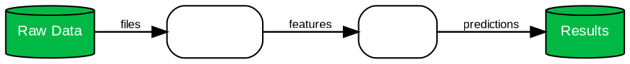

# Framework Diagram Patterns

## Pattern 1: Simple Sequential Pipeline



## Pattern 2: Multi-branch Architecture

Use `rankdir=TB` with branching and merging:

```dot
  input -> branchA;
  input -> branchB;
  branchA -> merge;
  branchB -> merge;
  merge -> output;
```

## Pattern 3: Feedback Loop

```dot
  output -> feedback [label="loss"];
  feedback -> model [label="gradients", style=dashed];
```

## Pattern 4: Nested Modules (Subgraphs)

```dot
  subgraph cluster_encoder {
    label="Encoder";
    style=dashed;
    color="#CCCCCC";
    conv1; conv2; pool;
  }
```
